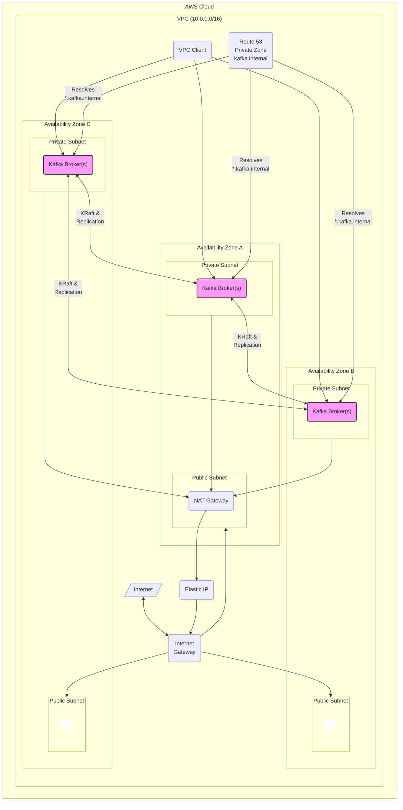

# Kafka Playground on AWS

This project uses Pulumi to deploy a production-ready, highly available Apache Kafka cluster on AWS.

## Architecture Diagram

The following diagram illustrates the architecture of the deployed Kafka cluster.

