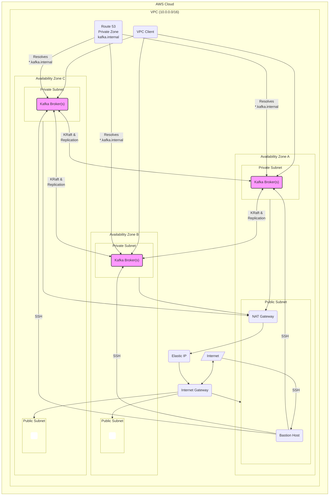

# Kafka Playground on AWS

This project uses Pulumi to deploy a production-ready, highly available Apache Kafka cluster on AWS.

## Architecture Diagram

The following diagram illustrates the architecture of the deployed Kafka cluster, including a bastion host for secure external access.



## Prerequisites

1.  [Pulumi CLI](https://www.pulumi.com/docs/get-started/install/)
2.  [Go](https://golang.org/doc/install)
3.  [AWS Account and configured credentials](https://www.pulumi.com/docs/clouds/aws/get-started/begin/)
4.  An EC2 Key Pair for SSH access to the bastion host.

### Creating an EC2 Key Pair

If you don't have an EC2 key pair, you can create one using either the AWS CLI or the AWS Console:

#### Option 1: Using AWS CLI
```bash
# Create a new key pair and save the private key
aws ec2 create-key-pair --key-name kafka-playground-key --query 'KeyMaterial' --output text > kafka-playground-key.pem

# Set proper permissions for the private key
chmod 400 kafka-playground-key.pem
```

#### Option 2: Using AWS Console
1. Go to the [AWS EC2 Console](https://console.aws.amazon.com/ec2/)
2. In the left navigation pane, click on "Key Pairs" under "Network & Security"
3. Click "Create key pair"
4. Enter a name for your key pair (e.g., `kafka-playground-key`)
5. Select "RSA" as the key pair type
6. Select ".pem" as the private key file format
7. Click "Create key pair"
8. The private key file will be automatically downloaded to your computer
9. Move the downloaded file to a secure location and set proper permissions:
   ```bash
   chmod 400 /path/to/your/downloaded-key.pem
   ```

**Note:** Keep your private key file secure and never share it. You'll need the key pair name (not the file path) for the Pulumi configuration.

## How to Run

1.  **Install dependencies:**
    ```bash
    go mod tidy
    ```

2.  **Configure the EC2 Key Pair:**
    Set the name of the EC2 key pair you want to use for the bastion host. Replace `<your-key-name>` with your actual key pair name.
    ```bash
    pulumi config set keyName <your-key-name>
    ```

3.  **Deploy the infrastructure:**
    This command will create all the necessary AWS resources.
    ```bash
    pulumi up --yes
    ```

4.  **Connect to Kafka:**
    Once the deployment is complete, you can access the Kafka cluster through the bastion host.

    a. Get the bastion's public IP address from the Pulumi stack outputs:
    ```bash
    pulumi stack output bastion_public_ip
    ```

    b. SSH into the bastion host. Use the path to your private key file (`.pem`).
    ```bash
    ssh -i /path/to/your/key.pem ec2-user@<bastion-public-ip>
    ```

    c. From the bastion host, you can now connect to the Kafka brokers using their internal DNS names, which are exported as `broker_endpoints`. For example, using `kafkacat`:
    ```bash
    # Get the broker endpoints
    pulumi stack output broker_endpoints
    
    # On the bastion host, produce a message
    echo "Hello, Kafka!" | kafkacat -b <one-of-the-broker-endpoints> -t my-topic -P

    # On the bastion host, consume a message
    kafkacat -b <one-of-the-broker-endpoints> -t my-topic -C -e
    ```

## Clean Up

To destroy all the resources created by this project, run the following command:
```bash
pulumi destroy --yes
```
